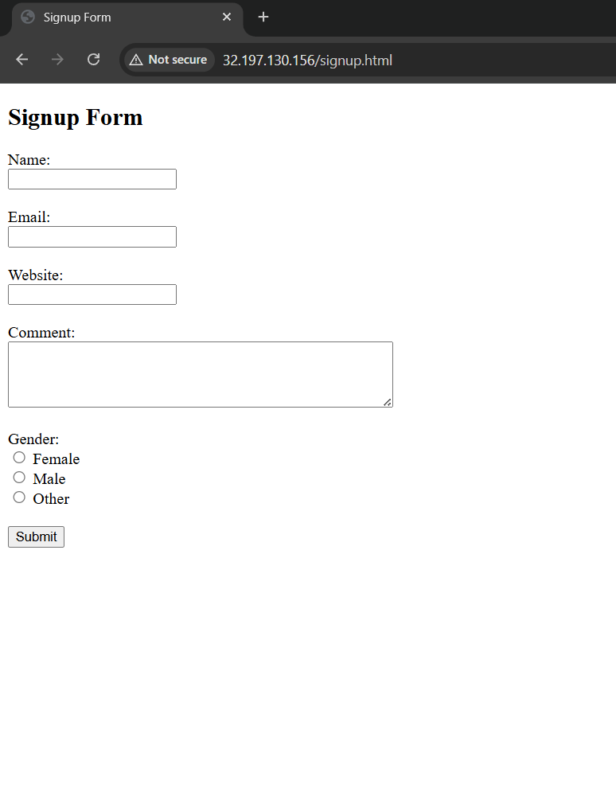
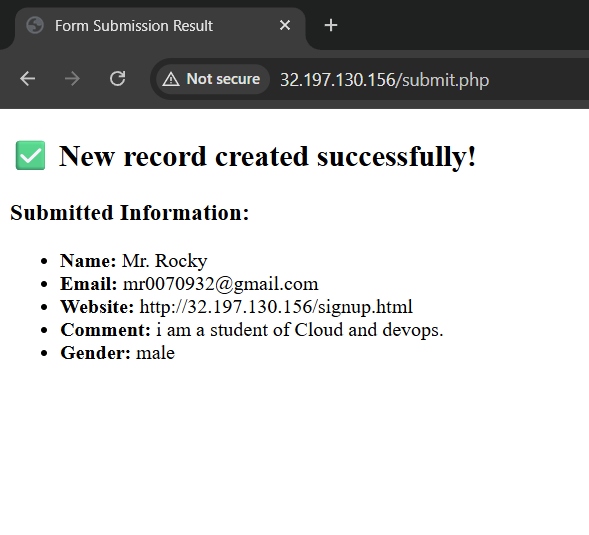
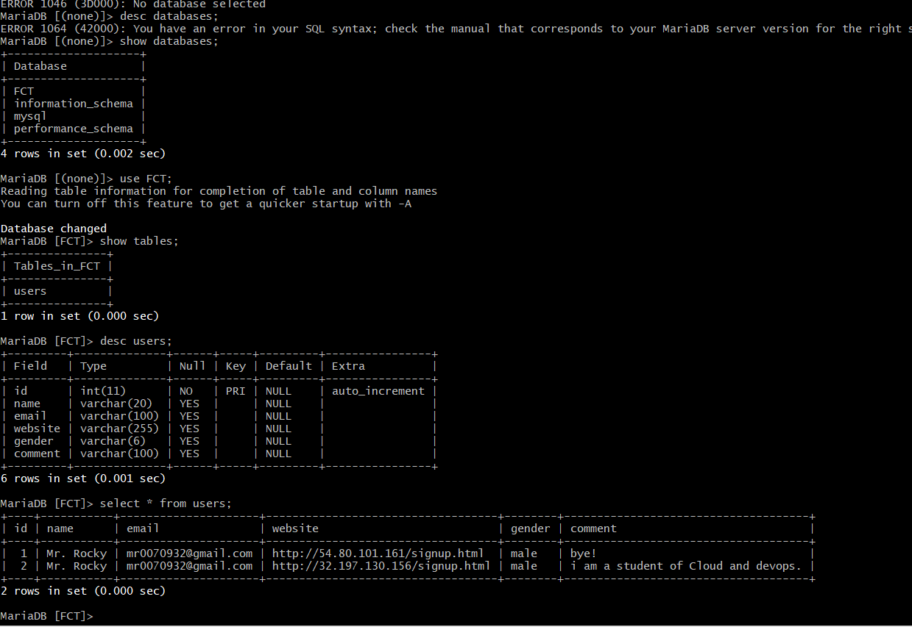
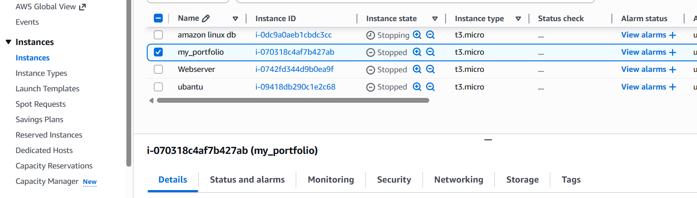

# Student Registration Form Deployment on AWS EC2 using NGINX, PHP & MariaDB

---

# Project Overview

This project demonstrates deployment of a Student Registration Form web application on an Amazon EC2 instance using Amazon Linux.

The application allows users to submit registration details through a web form, and the entered data is stored successfully in a MariaDB database.

This project was developed to gain practical knowledge in:

- Cloud deployment
- Linux server administration
- Web hosting
- Database integration
- Backend connectivity using PHP

---

# Technologies Used

| Technology | Purpose |
|------------|----------|
| AWS EC2 | Cloud Virtual Server |
| Amazon Linux | Operating System |
| NGINX | Web Server |
| MariaDB 10.5 | Database |
| PHP | Backend |
| HTML | Frontend |

---

# Project Architecture

```text
User Browser
      ↓
NGINX Web Server
      ↓
PHP Backend
      ↓
MariaDB Database
```

---

# Implementation Steps

---

# Step 1: Create EC2 Instance

Created an Amazon Linux EC2 instance and connected using SSH.

```bash
ssh -i "first.pem" ec2-user@ec2-13-221-32-203.compute-1.amazonaws.com
```

---

# Step 2: Install Required Packages

Installed:

- NGINX
- MariaDB
- PHP

Command:

```bash
sudo yum install nginx mariadb105-server php php -y
```

---

# Step 3: Start and Enable Services

Start services:

```bash
sudo systemctl start nginx mariadb php-fpm
```

Enable services:

```bash
sudo systemctl enable nginx mariadb php-fpm
```

Check status:

```bash
sudo systemctl status nginx mariadb php-fpm
```

---

# Step 4: Create Frontend (HTML)

Move to web directory:

```bash
cd /usr/share/nginx/html/
```

Create signup file:

```bash
sudo vim signup.html
```

Paste frontend code for Student Signup Form.

---

# Features

- Name
- Email
- Website
- Comment
- Gender
- Submit Button

---

# Step 5: Configure Database

Login to MariaDB:

```bash
sudo mysql
```

Set root password:

```sql
alter user root@localhost identified by 'root';
```

Create database:

```sql
CREATE DATABASE FCT;
```

Use database:

```sql
USE FCT;
```

Create table:

```sql
CREATE TABLE users (
    id INT PRIMARY KEY AUTO_INCREMENT,
    name VARCHAR(20),
    email VARCHAR(100),
    website VARCHAR(255),
    gender VARCHAR(6),
    comment VARCHAR(100)
);
```

---

# Step 6: Configure Backend (PHP)

Move to web directory:

```bash
cd /usr/share/nginx/html/
```

Create backend file:

```bash
sudo vim submit.php
```

Paste PHP backend code to:

- Receive form data
- Connect database
- Insert data into database
- Display successful submission message

---

# Step 7: Install PHP MySQL Connector

Install connector:

```bash
sudo yum install php8.5-mysqlnd.x86_64 -y
```

Restart services:

```bash
sudo systemctl restart nginx mariadb php-fpm
```

---

# Step 8: Access Application

Open browser and hit EC2 public IP:

```bash
http://13.221.32.203/signup.html
```

Student Registration Form opens successfully.

---

# Step 9: Verify Data Entry

Check inserted data:

```bash
sudo mysql -u root -p
```

Enter password:

```bash
root
```

Use database:

```sql
USE FCT;
```

Display records:

```sql
SELECT * FROM USERS;
```

Data stored successfully in database.

---

# Project Screenshots

## Registration Form



---

## Form Submission Success



---

## Database Records



---

## AWS EC2 Dashboard



---

# Project Output

- Student registration form deployed successfully
- Form accessible using EC2 public IP
- User data stored in MariaDB database
- Full cloud deployment completed successfully

---

# Learning Outcomes

Through this project I learned:

- AWS EC2 deployment
- Linux server management
- NGINX web server configuration
- MariaDB database setup
- PHP backend integration
- Full-stack cloud deployment
- Troubleshooting services

---

# Problems Faced During Deployment

During deployment, some common issues were faced:

- Database connection errors
- PHP connector installation problems
- Service restart issues
- Linux command mistakes
- MariaDB syntax errors

These issues were solved using troubleshooting commands and service status checking.

---

# Useful Commands

## Show Databases

```sql
SHOW DATABASES;
```

## Use Database

```sql
USE FCT;
```

## Show Tables

```sql
SHOW TABLES;
```

## Describe Table

```sql
DESC users;
```

## Display Records

```sql
SELECT * FROM users;
```

---

# Future Improvements

Future improvements planned for this project:

- Add CSS styling
- Add Bootstrap UI
- Add Login Authentication
- Add Password Encryption
- Add HTTPS SSL Certificate
- Deploy using Load Balancer
- Docker Containerization
- CI/CD Pipeline

---

# Author

Aryan Rajendra Dhawas 
MCA Cloud And Devops Engineering  
Fortune Cloud Technology

---

# Summary

This project is a simple cloud-based Student Registration Form application developed using AWS EC2, NGINX, PHP, and MariaDB.

The project provided practical experience in cloud hosting, Linux server management, backend integration, and database handling in a real-time environment.